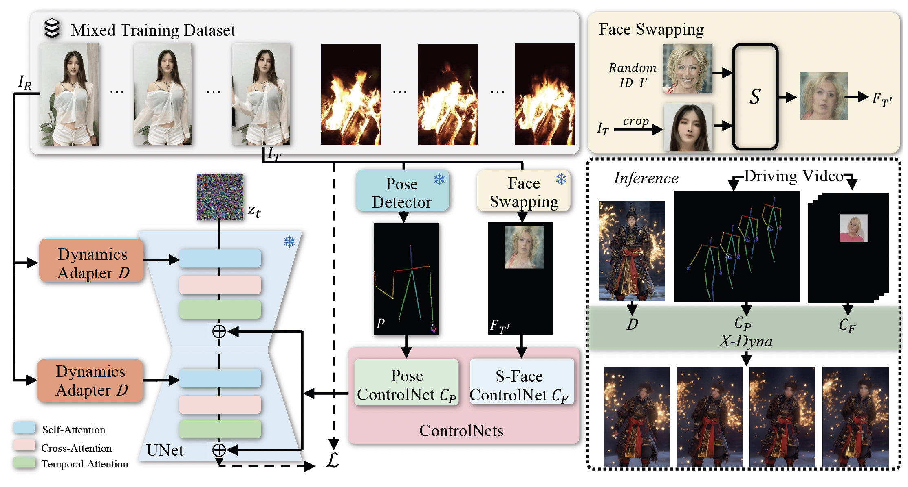
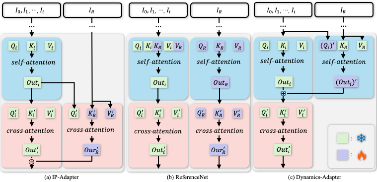

<p align="center">

  <h2 align="center">X-Dyna: Expressive Dynamic Human Image Animation</h2>
  <p align="center">
      <a href="https://boese0601.github.io/">Di Chang</a><sup>1,2</sup>
      ·
      <a href="https://hongyixu37.github.io/homepage/">Hongyi Xu</a><sup>2*</sup>
    ·  
      <a href="https://youxie.github.io/">You Xie</a><sup>2*</sup>
    ·  
      <a href="https://hlings.github.io/">Yipeng Gao</a><sup>1*</sup>
    ·  
      <a href="https://zhengfeikuang.com/">Zhengfei Kuang</a><sup>3*</sup>
    ·  
      <a href="https://primecai.github.io/">Shengqu Cai</a><sup>3*</sup>
    ·  
      <a href="https://zhangchenxu528.github.io/">Chenxu Zhang</a><sup>2*</sup>
    <br>
      <a href="https://guoxiansong.github.io/homepage/index.html">Guoxian Song</a><sup>2</sup>
    ·  
      <a href="https://chaowang.info/">Chao Wang</a><sup>2</sup>
    ·  
      <a href="https://seasonsh.github.io/">Yichun Shi</a><sup>2</sup>
    ·  
      <a href="https://zeyuan-chen.com/">Zeyuan Chen</a><sup>2,5</sup>
    ·  
      <a href="https://shijiezhou-ucla.github.io/">Shijie Zhou</a><sup>4</sup>
    ·  
      <a href="https://scholar.google.com/citations?user=fqubyX0AAAAJ&hl=en">Linjie Luo</a><sup>2</sup>
    <br>
      <a href="https://web.stanford.edu/~gordonwz/">Gordon Wetzstein</a><sup>3</sup>
    ·  
      <a href="https://www.ihp-lab.org/">Mohammad Soleymani</a><sup>1</sup>
    <br>
    <sup>1</sup>Unviersity of Southern California &nbsp;<sup>2</sup>ByteDance Inc. &nbsp; <sup>3</sup>Stanford University &nbsp; 
    <br>
    <sup>4</sup>University of California Los Angeles&nbsp; <sup>5</sup>University of California San Diego
    <br>
    <br>
    <sup>*</sup> denotes equal contribution
    <br>
    </br>
        <a href="">
        
        </a>
        <a href='https://x-dyna.github.io/xdyna.github.io/'>
        </a>
        <a href='https://huggingface.co/Boese0601/X-Dyna'>
        </a>
     </br>
</p>


-----

This repo is the official pytorch implementation of X-Dyna, which generates temporal-consistent human motions with expressive dynamics.


## 📹 Teaser Video

<div align="center">
  <video src="https://github.com/user-attachments/assets/9c7051ab-00ac-4a46-bfde-bc9f0492b7ad" width="50%">
</div>

The video is compressed to low quality due to GitHub's limit. The high quality version can be view from [here](https://youtube.com).

## 📑 Open-source Plan
- [x] Project Page
- [x] Paper
- [x] Inference code for Dynamics Adapter
- [x] Checkpoints for Dynamics Adapter
- [x] Inference code for S-Face ControlNet
- [x] Checkpoints for S-Face ControlNet
- [ ] Evaluation code (DTFVD, Face-Cos, Face-Det, FID, etc.)
- [ ] Dynamic Texture Eval Data (self-collected from [Pexels](https://www.pexels.com/))
- [ ] Alignment code for inference
- [ ] Gradio Demo


## **Abstract**
We introduce X-Dyna, a novel zero-shot, diffusion-based pipeline for animating a single human image using facial expressions and body movements derived from a driving video, that generates realistic, context-aware dynamics for both the subject and the surrounding environment. Building on prior approaches centered on human pose control, X-Dyna addresses key factors underlying the loss of dynamic details, enhancing the lifelike qualities of human video animations. At the core of our approach is the Dynamics-Adapter, a lightweight module that effectively integrates reference appearance context into the spatial attentions of the diffusion backbone while preserving the capacity of motion modules in synthesizing fluid and intricate dynamic details. Beyond body pose control, we connect a local control module with our model to capture identity-disentangled facial expressions, facilitating accurate expression transfer for enhanced realism in animated scenes. Together, these components form a unified framework capable of learning physical human motion and natural scene dynamics from a diverse blend of human and scene videos. Comprehensive qualitative and quantitative evaluations demonstrate that X-Dyna outperforms state-of-the-art methods, creating highly lifelike and expressive animations.

## **Architecture**

We leverage a pretrained diffusion UNet backbone for controlled human image animation, enabling expressive dynamic details and precise motion control. Specifically, we introduce a dynamics adapter that seamlessly integrates the reference image context as a trainable residual to the spatial attention, in parallel with the denoising process, while preserving the original spatial and temporal attention mechanisms within the UNet. In addition to body pose control via a ControlNet, we introduce a local face control module that implicitly learns facial expression control from a synthesized cross-identity face patch. We train our model on a diverse dataset of human motion videos and natural scene videos simultaneously.

<p align="center">
  
</p>

## **Dynamics Adapter**
### **Archtecture Designs for Human Video Animation**
a) IP-Adapter encodes the reference image as an image CLIP embedding and injects the information into the cross-attention layers in SD as the residual. b) ReferenceNet is a trainable parallel UNet and feeds the semantic information into SD via concatenation of self-attention features. c) Dynamics-Adapter encodes the reference image with a partially shared-weight UNet. The appearance control is realized by learning a residual in the self-attention with trainable query and output linear layers. All other components share the same frozen weight with SD.

<p align="center">
  
</p>


https://github.com/user-attachments/assets/f3856eea-9c81-4350-9532-a1a9fcebc528


## 📈 Results
### Comparison
To evaluate the dynamics texture generation performance of X-Dyna in human video animation, we compare the generation results of X-Dyna with MagicPose (ReferenceNet-based method) and MimicMotion (SVD-based method). For a fair comparison, all generated videos share the same resolution of Height x Width = 896 x 512. 


https://github.com/user-attachments/assets/532f5428-ec13-4ade-8f96-a4834a5738e6

https://github.com/user-attachments/assets/fccdc528-5453-49d3-80f3-8146f157aceb

https://github.com/user-attachments/assets/712cec90-3382-4911-a0e5-d636d5d48b3e


https://github.com/user-attachments/assets/aa3940d4-801d-44f6-9b2c-b03034a75b72

https://github.com/user-attachments/assets/efc18a25-a389-4aab-ad0c-dc835bc360f0


### Ablation 
To evaluate the effectiveness of the mix data training in our pipeline, we present a visualized ablation study.

https://github.com/user-attachments/assets/6eeed683-e08d-48dd-bab2-357404717aa4

https://github.com/user-attachments/assets/509e8b9f-ea6d-4465-a72c-ab3be435e25f


## 🎥 More Demos

<table class="center">
  <tr>
    <td><video src="https://github.com/user-attachments/assets/1a8a9f3e-8d2f-42c4-a0c5-549aae6cdb42" width="16%"></td>
    <td><video src="https://github.com/user-attachments/assets/243d4f66-64c3-4838-8ff4-02b54938755d" width="16%"></td>
  <tr>
    <td><video src="https://github.com/user-attachments/assets/180da137-1800-4058-8bf7-ad13b52a98ad" width="16%"></td>
    <td><video src="https://github.com/user-attachments/assets/f4614a1a-380e-46f2-ac16-6dbf0f568058" width="16%"></td>
  </tr>
  <tr>
    <td><video src="https://github.com/user-attachments/assets/f43ecda3-ddd2-46e1-a45c-7f32e21f1361" width="16%"></td>
    <td><video src="https://github.com/user-attachments/assets/7c67a686-0fce-4a35-8aa3-56aaa6423a42" width="16%"></td>
  <tr>
    <td><video src="https://github.com/user-attachments/assets/798a9622-5fac-4781-9db3-613f178227b8" width="16%"></td>
    <td><video src="https://github.com/user-attachments/assets/5bfded14-34e8-4715-bbda-ff66bb8e533a" width="16%"></td>
  </tr>
</table>


## 📜 Requirements
* An NVIDIA GPU with CUDA support is required. 
  * We have tested on a single A100 GPU.
  * In our experiment, we used CUDA 11.8.
  * **Minimum**: The minimum GPU memory required is 20GB for generating a single video (batch_size=1) of 16 frames.
  * **Recommended**: We recommend using a GPU with 80GB of memory.
* Operating system: Linux Debian 11 (bullseye)

## 🛠️ Dependencies and Installation

Clone the repository:
```shell
git clone https://github.com/Boese0601/X-Dyna
cd X-Dyna
```

### Installation Guide

We provide an `requirements.txt` file for setting up the environment.

Run the following command on your terminal:
```shell
# 1. Prepare conda environment
conda create -n xdyna python==3.10 

# 2. Activate the environment
conda activate xdyna

# 3. Install dependencies
bash env_torch2_install.sh

# I know it's a bit weird that pytorch is installed with different versions twice in that bash file, but I don't know why it doesn't work if I directly installed the final one (torch==2.0.1+cu118 torchaudio==2.0.2+cu118 torchvision==0.15.2+cu118). 
# If you managed to fix this, please open an issue and let me know, thanks. :DDDDD   
# o_O I hate environment and dependencies errors. 
```

## 🧱 Download Pretrained Models
Due to restrictions, we are not able to release the model pre-trained with in-house data. Instead, we re-train our model on public datasets, e.g. [HumanVid](https://github.com/zhenzhiwang/HumanVid), and other human video data for research use, e.g. [Pexels](https://www.pexels.com/). 

We follow the implementation details in our paper and release pretrained weights and other network modules in [this huggingface repository](https://huggingface.co/Boese0601/X-Dyna). After downloading, please put all of them under the [pretrained_weights](pretrained_weights/) folder. 

The Stable Diffusion 1.5 UNet can be found [here](https://huggingface.co/stable-diffusion-v1-5/stable-diffusion-v1-5) and place it under [pretrained_weights/initialization/unet_initialization/SD](pretrained_weights/initialization/unet_initialization/SD). 

Your file structure should look like this:

```bash
X-Dyna
|----...
|----pretrained_weights
  |----controlnet
    |----controlnet-checkpoint-epoch-5.ckpt
  |----controlnet_face
    |----controlnet-face-checkpoint-epoch-2.ckpt
  |----unet 
    |----unet-checkpoint-epoch-5.ckpt
  
  |----initialization
    |----controlnets_initialization
      |----controlnet
        |----control_v11p_sd15_openpose
      |----controlnet_face
        |----controlnet2
    |----unet_initialization
      |----IP-Adapter
        |----IP-Adapter
      |----SD
        |----stable-diffusion-v1-5
|----...
``` 

## Inference

### Using Command Line

```bash
cd X-Dyna

bash scripts/inference.sh
```

### More Configurations

We list some explanations of configurations below:

|        Argument        |          Default         |                Description                |
|:----------------------:|:------------------------:|:-----------------------------------------:|
|        `--gpus`        |             0            |             GPU ID for inference          |
|       `--output`       |         ./output         |     Path to save the generated video      |
|   `--test_data_file`   |  ./examples/example.json |     Path to reference and driving data    |
|        `--cfg`         |            7.5           |        Classifier-free guidance scale     |
|       `--height`       |            896           |         Height of the generated video     |
|       `--width`        |            512           |         Width of the generated video      |
|    `--infer_config`    |   ./configs/x_dyna.yaml  |     Path to inference model config file   |
|      `--neg_prompt`    |            None          |        Negative prompt for generation     |
|       `--length`       |            192           |         Length of the generated video     |
|       `--stride`       |             1            |       Stride of driving pose and video    |
|      `--save_fps`      |            15            |           FPS of the generated video      |
|     `--global_seed`    |            42            |                  Random seed              |
|  `--face_controlnet`   |           False          |      Use Face ControlNet for inference    |
|      `--cross_id`      |           False          |                Cross-Identity             |
|  `--no_head_skeleton`  |           False          |      Head skeletons are not visuliazed    |


### Alignment

Appropriate **alignment** between driving video and reference image is necessary for better generation quality. E.g. see examples below:
<br>
From left to right: Reference Image, Extracted Pose from Reference Image, Driving Video, Aligned Driving Pose.
<table class="center">
  <tr>
    <td><video src="https://github.com/user-attachments/assets/762a413d-c21e-49d1-923f-a8a918358b6f" width="24%"></td>
    <td><video src="https://github.com/user-attachments/assets/ba07da90-8628-4ada-ab53-6fad532c64d9" width="24%"></td>
  <tr>
    <td><video src="https://github.com/user-attachments/assets/5804a862-9b3f-4ef4-80ef-9d40a874974b" width="24%"></td>
    <td><video src="https://github.com/user-attachments/assets/11511e0a-81d0-46af-8a60-fa732f8bd928" width="24%"></td>
  </tr>
</table>


### Examples
We provide some examples of aligned driving videos, human poses and reference images [here](assets/). If you would like to try on your own data, please specify the paths in [this file](examples/example.json).


## 🔗 BibTeX
If you find [X-Dyna](https://arxiv.org) useful for your research and applications, please cite X-Dyna using this BibTeX:

```BibTeX
@misc{
}
```


## License

Our code is distributed under the Apache-2.0 license. See `LICENSE.txt` file for more information.


## Acknowledgements

We appreciate the contributions from [AnimateDiff](https://github.com/guoyww/AnimateDiff), [MagicPose](https://github.com/Boese0601/MagicDance), [MimicMotion](https://github.com/tencent/MimicMotion), [Moore-AnimateAnyone](https://github.com/MooreThreads/Moore-AnimateAnyone), [MagicAnimate](https://github.com/magic-research/magic-animate), [IP-Adapter](https://github.com/tencent-ailab/IP-Adapter), [ControlNet](https://arxiv.org/abs/2302.05543), [HumanVid](https://github.com/zhenzhiwang/HumanVid), [I2V-Adapter](https://arxiv.org/abs/2312.16693) for their open-sourced research. We appreciate the support from <a href="https://zerg-overmind.github.io/">Quankai Gao</a>, <a href="https://xharlie.github.io/">Qiangeng Xu</a>, <a href="https://ssangx.github.io/">Shen Sang</a>, and <a href="https://tiancheng-zhi.github.io/">Tiancheng Zhi</a> for their suggestions and discussions.


